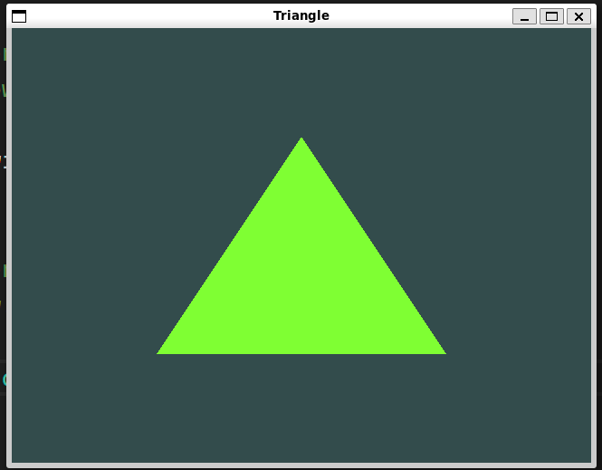

# OpenGL Triangle Rendering Project

## Project Description

This project is a simple demonstration of OpenGL rendering where I have practiced drawing a basic triangle. The main objective was to understand the fundamentals of OpenGL, including setting up the environment, creating a window, and rendering a 2D shape. Credit to the turtorial at https://learnopengl.com/ for helping me.

## Features

- Set up an OpenGL context.
- Created a window.
- Rendered a triangle.

## Screenshot

## Learning Outcomes

- Understanding of OpenGL pipeline.
- Experience with setting up an OpenGL context.
- Basic knowledge of shaders and rendering.
- Dependency managment with vcpkg
- Cmake project managment in c++
